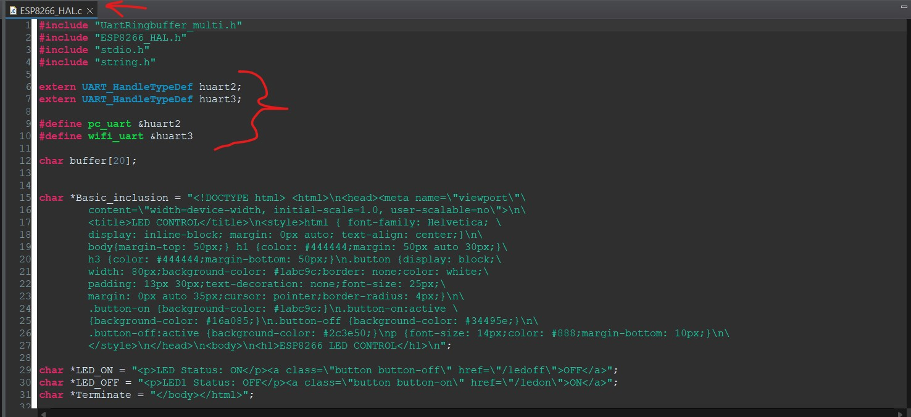
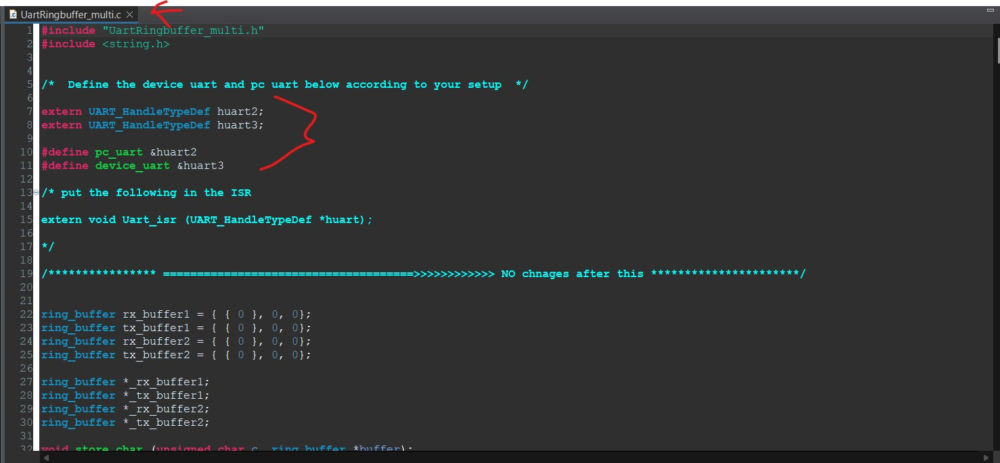
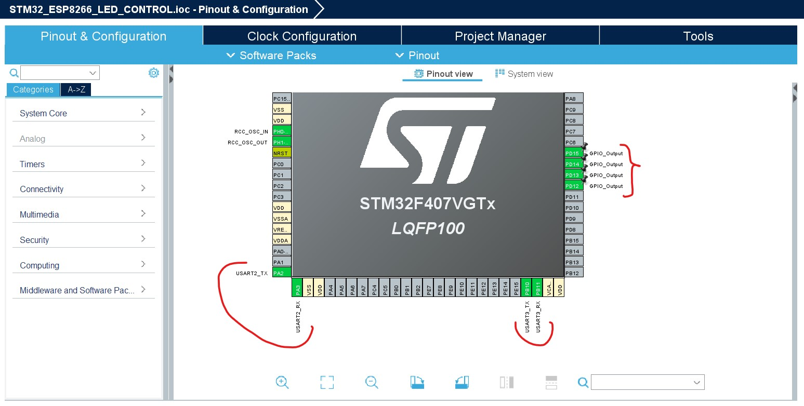
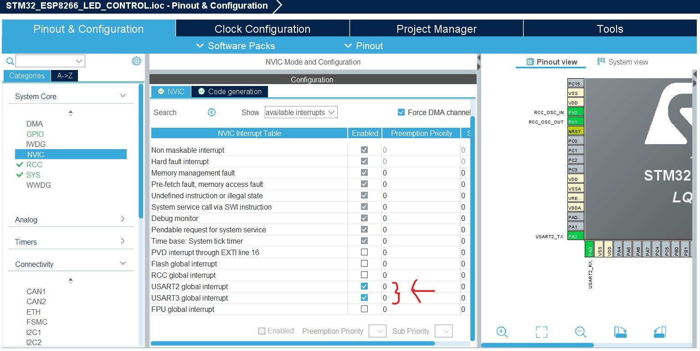
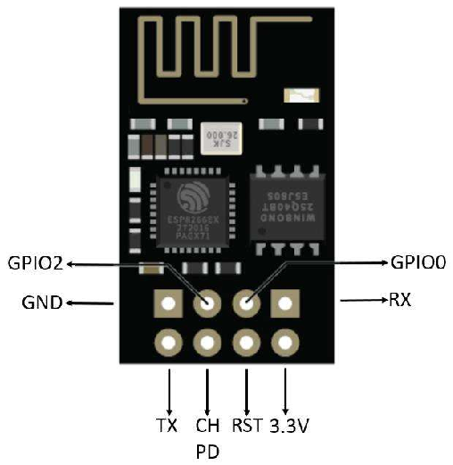
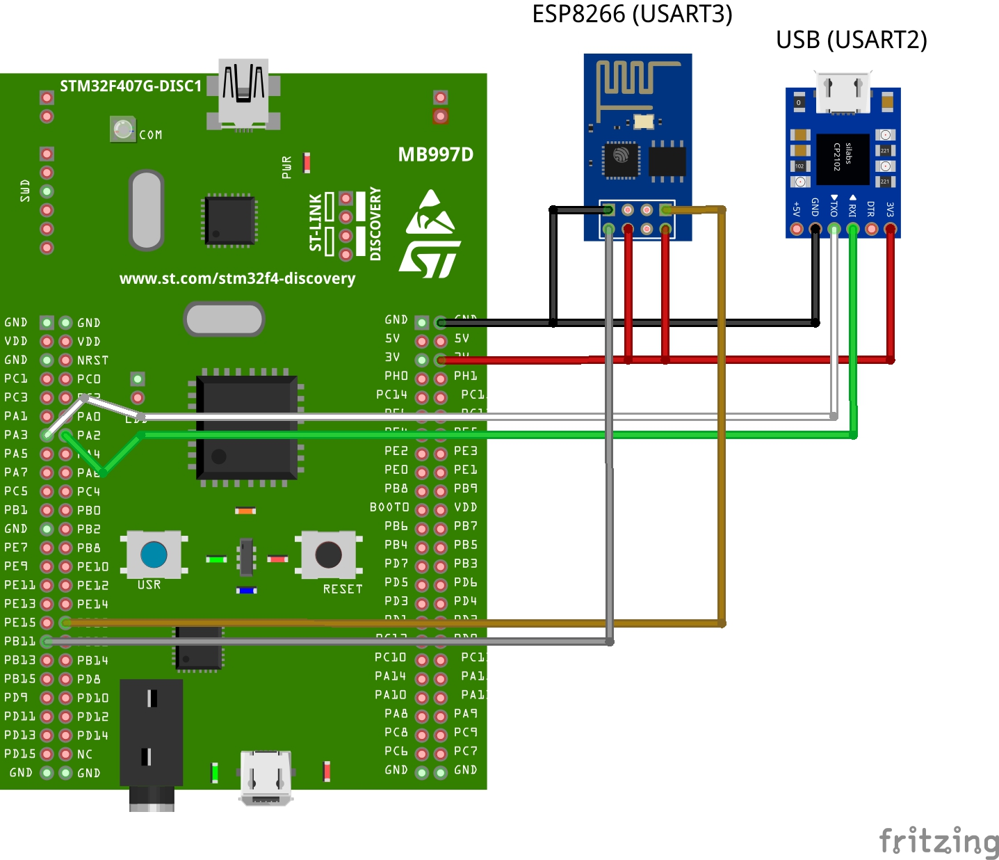

# STM32 ESP8266 LED CONTROL
LED control with ESP8266 using STM32 is a project

- ***Link headers***
  - [Note](#note)<br/>
  - [Setup](#setup)<br/>
  - [ESP8266 Pinout](#esp8266-pinout)<br/>
  - [Circuit](#circuit)<br/>
  - [Main Code](#code-mainc)<br/>
  - [ESP8266 HAL Code](#code-esp8266_halc)<br/>

## NOTE
> [!NOTE]
> The uart to be used from the files must be selected.
> 
> 

## SETUP
2 USARTs should be selected

***
The Interrupts in both should be obvious

***

## ESP8266 Pinout:


## Circuit


## Code "main.c"
```c++
/* USER CODE BEGIN Header */
/**
  ******************************************************************************
  * @file           : main.c
  * @brief          : Main program body
  ******************************************************************************
  * @attention
  *
  * Copyright (c) 2024 STMicroelectronics.
  * All rights reserved.
  *
  * This software is licensed under terms that can be found in the LICENSE file
  * in the root directory of this software component.
  * If no LICENSE file comes with this software, it is provided AS-IS.
  *
  ******************************************************************************
  */
/* USER CODE END Header */
/* Includes ------------------------------------------------------------------*/
#include "main.h"

/* Private includes ----------------------------------------------------------*/
/* USER CODE BEGIN Includes */


#include "ESP8266_HAL.h"


/* USER CODE END Includes */

/* Private typedef -----------------------------------------------------------*/
/* USER CODE BEGIN PTD */

/* USER CODE END PTD */

/* Private define ------------------------------------------------------------*/
/* USER CODE BEGIN PD */

/* USER CODE END PD */

/* Private macro -------------------------------------------------------------*/
/* USER CODE BEGIN PM */

/* USER CODE END PM */

/* Private variables ---------------------------------------------------------*/
UART_HandleTypeDef huart2;
UART_HandleTypeDef huart3;

/* USER CODE BEGIN PV */

/* USER CODE END PV */

/* Private function prototypes -----------------------------------------------*/
void SystemClock_Config(void);
static void MX_GPIO_Init(void);
static void MX_USART2_UART_Init(void);
static void MX_USART3_UART_Init(void);
/* USER CODE BEGIN PFP */

/* USER CODE END PFP */

/* Private user code ---------------------------------------------------------*/
/* USER CODE BEGIN 0 */

/* USER CODE END 0 */

/**
  * @brief  The application entry point.
  * @retval int
  */
int main(void)
{

  /* USER CODE BEGIN 1 */

  /* USER CODE END 1 */

  /* MCU Configuration--------------------------------------------------------*/

  /* Reset of all peripherals, Initializes the Flash interface and the Systick. */
  HAL_Init();

  /* USER CODE BEGIN Init */

  /* USER CODE END Init */

  /* Configure the system clock */
  SystemClock_Config();

  /* USER CODE BEGIN SysInit */

  /* USER CODE END SysInit */

  /* Initialize all configured peripherals */
  MX_GPIO_Init();
  MX_USART2_UART_Init();
  MX_USART3_UART_Init();
  /* USER CODE BEGIN 2 */


  //Your Wifi SSID and your Wifi password
  ESP_Init("Your SSID","Your password");


  /* USER CODE END 2 */

  /* Infinite loop */
  /* USER CODE BEGIN WHILE */
  while (1)
  {
    /* USER CODE END WHILE */

    /* USER CODE BEGIN 3 */


	  Server_Start();


  }
  /* USER CODE END 3 */
}

/**
  * @brief System Clock Configuration
  * @retval None
  */
void SystemClock_Config(void)
{
  RCC_OscInitTypeDef RCC_OscInitStruct = {0};
  RCC_ClkInitTypeDef RCC_ClkInitStruct = {0};

  /** Configure the main internal regulator output voltage
  */
  __HAL_RCC_PWR_CLK_ENABLE();
  __HAL_PWR_VOLTAGESCALING_CONFIG(PWR_REGULATOR_VOLTAGE_SCALE1);

  /** Initializes the RCC Oscillators according to the specified parameters
  * in the RCC_OscInitTypeDef structure.
  */
  RCC_OscInitStruct.OscillatorType = RCC_OSCILLATORTYPE_HSE;
  RCC_OscInitStruct.HSEState = RCC_HSE_ON;
  RCC_OscInitStruct.PLL.PLLState = RCC_PLL_ON;
  RCC_OscInitStruct.PLL.PLLSource = RCC_PLLSOURCE_HSE;
  RCC_OscInitStruct.PLL.PLLM = 4;
  RCC_OscInitStruct.PLL.PLLN = 168;
  RCC_OscInitStruct.PLL.PLLP = RCC_PLLP_DIV2;
  RCC_OscInitStruct.PLL.PLLQ = 7;
  if (HAL_RCC_OscConfig(&RCC_OscInitStruct) != HAL_OK)
  {
    Error_Handler();
  }

  /** Initializes the CPU, AHB and APB buses clocks
  */
  RCC_ClkInitStruct.ClockType = RCC_CLOCKTYPE_HCLK|RCC_CLOCKTYPE_SYSCLK
                              |RCC_CLOCKTYPE_PCLK1|RCC_CLOCKTYPE_PCLK2;
  RCC_ClkInitStruct.SYSCLKSource = RCC_SYSCLKSOURCE_PLLCLK;
  RCC_ClkInitStruct.AHBCLKDivider = RCC_SYSCLK_DIV1;
  RCC_ClkInitStruct.APB1CLKDivider = RCC_HCLK_DIV4;
  RCC_ClkInitStruct.APB2CLKDivider = RCC_HCLK_DIV2;

  if (HAL_RCC_ClockConfig(&RCC_ClkInitStruct, FLASH_LATENCY_5) != HAL_OK)
  {
    Error_Handler();
  }
}

/**
  * @brief USART2 Initialization Function
  * @param None
  * @retval None
  */
static void MX_USART2_UART_Init(void)
{

  /* USER CODE BEGIN USART2_Init 0 */

  /* USER CODE END USART2_Init 0 */

  /* USER CODE BEGIN USART2_Init 1 */

  /* USER CODE END USART2_Init 1 */
  huart2.Instance = USART2;
  huart2.Init.BaudRate = 115200;
  huart2.Init.WordLength = UART_WORDLENGTH_8B;
  huart2.Init.StopBits = UART_STOPBITS_1;
  huart2.Init.Parity = UART_PARITY_NONE;
  huart2.Init.Mode = UART_MODE_TX_RX;
  huart2.Init.HwFlowCtl = UART_HWCONTROL_NONE;
  huart2.Init.OverSampling = UART_OVERSAMPLING_16;
  if (HAL_UART_Init(&huart2) != HAL_OK)
  {
    Error_Handler();
  }
  /* USER CODE BEGIN USART2_Init 2 */

  /* USER CODE END USART2_Init 2 */

}

/**
  * @brief USART3 Initialization Function
  * @param None
  * @retval None
  */
static void MX_USART3_UART_Init(void)
{

  /* USER CODE BEGIN USART3_Init 0 */

  /* USER CODE END USART3_Init 0 */

  /* USER CODE BEGIN USART3_Init 1 */

  /* USER CODE END USART3_Init 1 */
  huart3.Instance = USART3;
  huart3.Init.BaudRate = 115200;
  huart3.Init.WordLength = UART_WORDLENGTH_8B;
  huart3.Init.StopBits = UART_STOPBITS_1;
  huart3.Init.Parity = UART_PARITY_NONE;
  huart3.Init.Mode = UART_MODE_TX_RX;
  huart3.Init.HwFlowCtl = UART_HWCONTROL_NONE;
  huart3.Init.OverSampling = UART_OVERSAMPLING_16;
  if (HAL_UART_Init(&huart3) != HAL_OK)
  {
    Error_Handler();
  }
  /* USER CODE BEGIN USART3_Init 2 */

  /* USER CODE END USART3_Init 2 */

}

/**
  * @brief GPIO Initialization Function
  * @param None
  * @retval None
  */
static void MX_GPIO_Init(void)
{
  GPIO_InitTypeDef GPIO_InitStruct = {0};
/* USER CODE BEGIN MX_GPIO_Init_1 */
/* USER CODE END MX_GPIO_Init_1 */

  /* GPIO Ports Clock Enable */
  __HAL_RCC_GPIOH_CLK_ENABLE();
  __HAL_RCC_GPIOA_CLK_ENABLE();
  __HAL_RCC_GPIOB_CLK_ENABLE();
  __HAL_RCC_GPIOD_CLK_ENABLE();

  /*Configure GPIO pin Output Level */
  HAL_GPIO_WritePin(GPIOD, GPIO_PIN_12|GPIO_PIN_13|GPIO_PIN_14|GPIO_PIN_15, GPIO_PIN_RESET);

  /*Configure GPIO pins : PD12 PD13 PD14 PD15 */
  GPIO_InitStruct.Pin = GPIO_PIN_12|GPIO_PIN_13|GPIO_PIN_14|GPIO_PIN_15;
  GPIO_InitStruct.Mode = GPIO_MODE_OUTPUT_PP;
  GPIO_InitStruct.Pull = GPIO_NOPULL;
  GPIO_InitStruct.Speed = GPIO_SPEED_FREQ_LOW;
  HAL_GPIO_Init(GPIOD, &GPIO_InitStruct);

/* USER CODE BEGIN MX_GPIO_Init_2 */
/* USER CODE END MX_GPIO_Init_2 */
}

/* USER CODE BEGIN 4 */

/* USER CODE END 4 */

/**
  * @brief  This function is executed in case of error occurrence.
  * @retval None
  */
void Error_Handler(void)
{
  /* USER CODE BEGIN Error_Handler_Debug */
  /* User can add his own implementation to report the HAL error return state */
  __disable_irq();
  while (1)
  {
  }
  /* USER CODE END Error_Handler_Debug */
}

#ifdef  USE_FULL_ASSERT
/**
  * @brief  Reports the name of the source file and the source line number
  *         where the assert_param error has occurred.
  * @param  file: pointer to the source file name
  * @param  line: assert_param error line source number
  * @retval None
  */
void assert_failed(uint8_t *file, uint32_t line)
{
  /* USER CODE BEGIN 6 */
  /* User can add his own implementation to report the file name and line number,
     ex: printf("Wrong parameters value: file %s on line %d\r\n", file, line) */
  /* USER CODE END 6 */
}
#endif /* USE_FULL_ASSERT */
```

## Code "ESP8266_HAL.c"
```c++
#include "UartRingbuffer_multi.h"
#include "ESP8266_HAL.h"
#include "stdio.h"
#include "string.h"

extern UART_HandleTypeDef huart2;
extern UART_HandleTypeDef huart3;

#define pc_uart &huart2
#define wifi_uart &huart3

char buffer[20];


char *Basic_inclusion = "<!DOCTYPE html> <html>\n<head><meta name=\"viewport\"\
		content=\"width=device-width, initial-scale=1.0, user-scalable=no\">\n\
		<title>LED CONTROL</title>\n<style>html { font-family: Helvetica; \
		display: inline-block; margin: 0px auto; text-align: center;}\n\
		body{margin-top: 50px;} h1 {color: #444444;margin: 50px auto 30px;}\
		h3 {color: #444444;margin-bottom: 50px;}\n.button {display: block;\
		width: 80px;background-color: #1abc9c;border: none;color: white;\
		padding: 13px 30px;text-decoration: none;font-size: 25px;\
		margin: 0px auto 35px;cursor: pointer;border-radius: 4px;}\n\
		.button-on {background-color: #1abc9c;}\n.button-on:active \
		{background-color: #16a085;}\n.button-off {background-color: #34495e;}\n\
		.button-off:active {background-color: #2c3e50;}\np {font-size: 14px;color: #888;margin-bottom: 10px;}\n\
		</style>\n</head>\n<body>\n<h1>ESP8266 LED CONTROL</h1>\n";

char *LED_ON = "<p>LED Status: ON</p><a class=\"button button-off\" href=\"/ledoff\">OFF</a>";
char *LED_OFF = "<p>LED1 Status: OFF</p><a class=\"button button-on\" href=\"/ledon\">ON</a>";
char *Terminate = "</body></html>";


/*****************************************************************************************************************************************/

void ESP_Init (char *SSID, char *PASSWD)
{
	char data[80];

	Ringbuf_init();

	Uart_sendstring("AT+RST\r\n", wifi_uart);
	Uart_sendstring("RESETTING.", pc_uart);
	for (int i=0; i<5; i++)
	{
		Uart_sendstring(".", pc_uart);
		HAL_Delay(1000);
	}

	/********* AT **********/
	Uart_sendstring("AT\r\n", wifi_uart);
	while(!(Wait_for("AT\r\r\n\r\nOK\r\n", wifi_uart)));
	Uart_sendstring("AT---->OK\n\n", pc_uart);


	/********* AT+CWMODE=1 **********/
	Uart_sendstring("AT+CWMODE=1\r\n", wifi_uart);
	while (!(Wait_for("AT+CWMODE=1\r\r\n\r\nOK\r\n", wifi_uart)));
	Uart_sendstring("CW MODE---->1\n\n", pc_uart);


	/********* AT+CWJAP="SSID","PASSWD" **********/
	Uart_sendstring("connecting... to the provided AP\n", pc_uart);
	sprintf (data, "AT+CWJAP=\"%s\",\"%s\"\r\n", SSID, PASSWD);
	Uart_sendstring(data, wifi_uart);
	while (!(Wait_for("WIFI GOT IP\r\n\r\nOK\r\n", wifi_uart)));
	sprintf (data, "Connected to,\"%s\"\n\n", SSID);
	Uart_sendstring(data,pc_uart);


	/********* AT+CIFSR **********/
	Uart_sendstring("AT+CIFSR\r\n", wifi_uart);
	while (!(Wait_for("CIFSR:STAIP,\"", wifi_uart)));
	while (!(Copy_upto("\"",buffer, wifi_uart)));
	while (!(Wait_for("OK\r\n", wifi_uart)));
	int len = strlen (buffer);
	buffer[len-1] = '\0';
	sprintf (data, "IP ADDR: %s\n\n", buffer);
	Uart_sendstring(data, pc_uart);


	Uart_sendstring("AT+CIPMUX=1\r\n", wifi_uart);
	while (!(Wait_for("AT+CIPMUX=1\r\r\n\r\nOK\r\n", wifi_uart)));
	Uart_sendstring("CIPMUX---->OK\n\n", pc_uart);

	Uart_sendstring("AT+CIPSERVER=1,80\r\n", wifi_uart);
	while (!(Wait_for("OK\r\n", wifi_uart)));
	Uart_sendstring("CIPSERVER---->OK\n\n", pc_uart);

	Uart_sendstring("Now Connect to the IP ADRESS\n\n", pc_uart);

}


int Server_Send (char *str, int Link_ID)
{
	int len = strlen (str);
	char data[80];
	sprintf (data, "AT+CIPSEND=%d,%d\r\n", Link_ID, len);
	Uart_sendstring(data, wifi_uart);
	while (!(Wait_for(">", wifi_uart)));
	Uart_sendstring (str, wifi_uart);
	while (!(Wait_for("SEND OK", wifi_uart)));
	sprintf (data, "AT+CIPCLOSE=5\r\n");
	Uart_sendstring(data, wifi_uart);
	while (!(Wait_for("OK\r\n", wifi_uart)));
	return 1;
}

void Server_Handle (char *str, int Link_ID)
{
	char datatosend[1024] = {0};
	if (!(strcmp (str, "/ledon")))
	{
		sprintf (datatosend, Basic_inclusion);
		strcat(datatosend, LED_ON);
		strcat(datatosend, Terminate);
		Server_Send(datatosend, Link_ID);
	}

	else if (!(strcmp (str, "/ledoff")))
	{
		sprintf (datatosend, Basic_inclusion);
		strcat(datatosend, LED_OFF);
		strcat(datatosend, Terminate);
		Server_Send(datatosend, Link_ID);
	}

	else
	{
		sprintf (datatosend, Basic_inclusion);
		strcat(datatosend, LED_OFF);
		strcat(datatosend, Terminate);
		Server_Send(datatosend, Link_ID);
	}

}

void Server_Start (void)
{
	char buftocopyinto[64] = {0};
	char Link_ID;
	while (!(Get_after("+IPD,", 1, &Link_ID, wifi_uart)));
	Link_ID -= 48;
	while (!(Copy_upto(" HTTP/1.1", buftocopyinto, wifi_uart)));
	if (Look_for("/ledon", buftocopyinto) == 1)
	{
		HAL_GPIO_WritePin(GPIOD, GPIO_PIN_15, 1);
		Server_Handle("/ledon",Link_ID);
	}

	else if (Look_for("/ledoff", buftocopyinto) == 1)
	{
		HAL_GPIO_WritePin(GPIOD, GPIO_PIN_15, 0);
		Server_Handle("/ledoff",Link_ID);
	}

	else if (Look_for("/favicon.ico", buftocopyinto) == 1);

	else
	{
		HAL_GPIO_WritePin(GPIOD, GPIO_PIN_15, 0);
		Server_Handle("/ ", Link_ID);
	}
}
```
